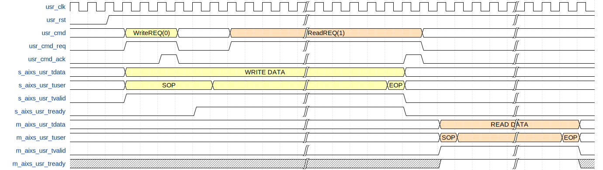

# 自述文件

# AFXSATA — FPGA-based SATA-DMA Host Controller

[](./README.md)
[](./README_en.md)


## 介绍

**AFXSATA** 是一个基于 **FPGA** 实现的 **SATA-DMA 主机控制器（SATA Host Controller）** ，支持 **SATA 3.0（6 Gbps）**  速率，支持访问256T大小硬盘，并可实现 **高达8 MB 的连续突发 DMA 读写**。

该项目基于 **Xilinx GTX（7 系列）**  与 **UltraScale GTH** 、**UltraScale+ GTY**高速收发器实现 **SATA 物理层（PHY）** ，**无需依赖厂商 SATA IP 核**，完整覆盖从物理层到命令层的简化DMA 协议。

设计采用 **极简三接口架构**，高效桥接用户命令接口与 **AXI-Stream** 数据通道，便于系统级集成与快速验证。  
用户既可以基于现有的物理层与命令层自行构建完整的 SATA 协议栈，也可直接使用命令层代码实现对SATA硬盘的 **DMA读写操作**。

此外，在微信公众号  **「AdriftCoreFPGA芯研社」**  中提供了详细的 **SATA 协议解析**，可帮助读者更深入地理解SATA 协议栈。

已验证平台和板卡：

* **STLV7325 XC7K325T**
* **Kintex UltraScale XCKU040**
* **RK-XCKU5P Kintex UltraScale+ XCKU5P**
‍

## 说明

### 模块

​`sata_wrapper`​

顶层模块，集成SATA物理层、链路层、传输层及命令处理模块，为用户应用提供完整的SATA控制器接口。

​`sata_gt_wrapper`​

SATA GT收发器封装模块，为不同型号收发器（GTX/GTH等）提供统一接口，负责SATA物理层通信的时钟、复位及数据路径连接。

​`sata_phy_ctrl`​

SATA物理层控制模块，实现链路初始化、速率协商、带外信号及数据传输/接收控制。

​`sata_link_ctrl`​

SATA链路层控制模块，负责数据编解码、流量控制及物理层与传输层间的通信协调，同时管理读写操作和链路状态机。

​`sata_link_arbt`​

SATA链路层仲裁模块，仲裁传输层读写请求以控制链路层访问，确保操作顺序并管理协议栈层间流量。

​`sata_link_wrmod`​

SATA链路层写入模块，负责写数据路径控制，管理包含帧起始/数据/CRC/帧结束/等待在内的完整写入状态机，并协调物理层数据传输与仲裁器信令交互。

​`sata_link_rdmod`​

SATA链路层读取模块，负责读数据路径控制，管理包含数据接收、CRC校验、传输层数据缓冲及链路层响应生成的完整读取状态机。

​`sata_link_ingress`​

SATA链路层入口模块，负责管理从传输层到链路层的写入数据流，提供数据缓冲与层间流量控制功能。

​`sata_link_egress`​

SATA链路层出口模块，管理内部逻辑至SATA接口的数据传输，作为用户逻辑与传输层间的缓冲区，负责流量控制与数据缓冲。

​`sata_link_crc`​

SATA链路层CRC模块，负责采用SATA标准多项式计算32位CRC校验值，初始值为0x52325032，通过实时数据更新确保数据传输完整性。

​`sata_link_lfsr`​

SATA链路层LFSR加扰模块，采用16位线性反馈移位寄存器实现数据加扰。该模块使用本原多项式G(X) = X¹⁶ + X¹⁵ + X¹³ + X⁴ + 1生成伪随机序列，初始值设为0xF0F6，首字输出符合SATA规范要求的0xC2D2768D。

​`sata_link_encode`​

SATA链路层编码模块，负责将传输层数据与原语编码为物理层所需格式，处理数据加扰、原语延续及对齐符插入操作。

​`sata_link_decode`​

SATA链路层解码模块，负责解析来自物理层的SATA原语与数据，具备原语类型识别、数据解扰功能，并向上层提供解码后数据。

​`sata_transport`​

SATA传输层模块，实现协议栈传输层功能，负责命令处理、数据流控制及链路层与用户应用间的接口管理，并能将各类FIS数据包路由至对应子模块处理。

​`sata_transport_pio`​

SATA传输层PIO模块，负责检测来自链路层的PIO建立请求并生成对应控制信号。该模块通过监控输入FIS数据包识别PIO建立命令，在启动PIO传输时准确触发PIO建立信号。

​`sata_transport_packet`​

SATA传输层数据包处理模块，负责在链路层与传输层间进行数据流管理，实现DMA操作中的数据缓冲、数据包组包及流控制功能。

​`sata_transport_dma`​

SATA传输层DMA模块，负责检测链路层的DMA激活请求并生成对应控制信号。该模块通过监控输入FIS数据包识别DMA建立命令，在启动DMA传输时准确触发DMA激活信号。

​`sata_transport_command`​

SATA传输层命令模块，负责主机与设备间的命令传输与接收，完成主机至设备(H2D)命令的组帧及设备至主机(D2H)响应的解析。

​`sata_command_dma_ctrl`​

SATA命令层与DMA控制器，负责管理SATA命令处理及DMA数据传输操作，执行读写命令、管理数据缓冲，并控制用户逻辑与SATA传输层间的接口。

​`sata_bist`​

SATA外置自测试模块，负责生成测试码型并验证数据完整性以及性能测试。

​`sata_bist_lfsr`​

用于SATA接口的线性反馈移位寄存器，实现外置自测试功能。

‍

### 接口

#### System Clock

|Signal|Direction|Description|
| ---------| -----------| ------------------------------------|
|clk|input|System clock input (100 MHz)|
|refclkp|input|Reference clock positive (150 MHz)|
|refclkn|input|Reference clock negative (150 MHz)|

#### GTX / GTH Interface

|Signal|Direction|Description|
| --------| -----------| ---------------------------------|
|gtxrxp|input|GTX receiver positive input|
|gtxrxn|input|GTX receiver negative input|
|gtxtxp|output|GTX transmitter positive output|
|gtxtxn|output|GTX transmitter negative output|

#### System Control

|Signal|Direction|Description|
| ------------| -----------| ------------------------------------|
|soft_reset|input|Software reset input (active high)|

‍

#### User Control

|Signal|Direction|Description|
| -------------| --------------| ---------------------------------------------------------------------------------------|
|usr_clk|output|User clock output(150Mz)|
|usr_rst|output|User reset output (active low)|
|usr_ctrl|input [1:0]|User control signals：bit0.command layer enable,bit1.command layer reset(active high)|
|usr_cmd|input [71:0]|**User command input:**  `{RW, len[22:0], addr[47:0]}`​ — `addr`​ must be **DW-aligned**, `RW`​: `1`​ \= read, `0`​ \= write|
|usr_cmd_req|input|User command request|
|usr_cmd_ack|output|User command acknowledge|

‍

#### AXI-Stream Data Interface

|Signal|Direction|Description|
| -------------------| ---------------| ------------------------------------------------------------------|
|s_aixs_usr_tdata|input [31:0]|Slave AXI stream data input|
|s_aixs_usr_tuser|input [7:0]|Slave AXI stream user signals: {drop, err, keep[3:0], sop, eop}|
|s_aixs_usr_tvalid|input|Slave AXI stream valid signal|
|s_aixs_usr_tready|output|Slave AXI stream ready signal|
|m_aixs_usr_tdata|output [31:0]|Master AXI stream data output|
|m_aixs_usr_tuser|output [7:0]|Master AXI stream user signals: {drop, err, keep[3:0], sop, eop}|
|m_aixs_usr_tvalid|output|Master AXI stream valid signal|
|m_aixs_usr_tready|input|Master AXI stream ready signal|

‍

### 时序

​​

由于SATA硬盘的物理特性，其读写操作必须以512字节的扇区为单位进行。为适配此特性，AFXSATA控制器有如下行为：

* **数据块**：读写的数据块大小**必须**是512字节的整数倍。
* **地址对齐**：**强烈建议**读写起始地址也按512字节对齐。若未对齐，AFXSATA将在起始非对齐部分自动填充0，这可能导致非预期的数据覆盖。
* **0长度**：当请求的 len 为 0 时，表示最大长度8 MB

### 源文件

```shell
gt_sata_common.sv
sata_link_ingress.sv
sata_link_arbt.sv
sata_gt_wrapper.sv
sata_transport_packet.sv
sata_transport_pio.sv
sata_link_arbt_dev.sv
sata_wrapper.sv
sata_link_rdmod.sv
sata_link_crc.sv
gt_sata_common_reset.sv
sata_link_decode.sv
sata_bist.sv
sata_reset_gen.sv
sata_transport_dma.sv
afx_fifo_wrapper.sv
afx_skid_buffer_axis.sv
afx_skid_buffer.sv
sata_transport_command.sv
sata_phy_ctrl.sv
sata_link_wrmod.sv
sata_link_encode.sv
sata_link_egress.sv
sata_transport.sv
sata_bist_lfsr.sv
sata_link_lfsr.sv
sata_link_wrmod_dev.sv
sata_link_ctrl_dev.sv
sata_link_ctrl.sv
sata_command_dma_ctrl.sv
```

‍

### 测试

#### 仿真

运行测试平台需安装cocotb、cocotbext-axi、vivado、vccs、verdi。支持两种运行方式：直接使用 pytest（需安装 cocotb-test）、或使用 cocotb makefiles。

```shell
adcore_cocotb_test_run.py
cocotb_top_sata_phy_ctrl.py
cocotb_top.py
cocotb_top_transport_dma.py
cocotb_top_sata_bist.py
tb_top_sata_phy_ctrl.sv # phy layer test
tb_top.sv				        # link layer test
tb_top_transport_dma.sv # transport & command layer test
tb_top_sata_bist.sv		  # bist test
```

‍

​​

​​

#### 上板

工程提供了 VIO 例程，可通过 `sata_example`​ 实现 **正确性测试** 和 **性能测试**

正确性测试（Functional Test）

* 配置 `mode = 0`​
* 配置 `cycle`​ 及每轮的读写次数，例如 `cycle = 4`​ 表示每轮写 4 次、读 4 次
* 配置 `num`​（单包长度，单位为 DW，最大支持0x20_0000 DW，也就是8MB）
* 配置起始地址 `addr`​
* 配置 `level`​，默认 `0x7fff_ffff`​，表示写操作有 50% 概率 valid 暂停，读操作有 50% 几率反压，0x0000_0000则是不反压不暂停，数值越大概率越高
* 关闭速度模式：`speed_test = 0`​
* 使能模块：`enable = 1`​
* 观察 `wr_cnt_eop`​ 和 `rd_cnt_eop`​ 表示已读写的包数
* 当 `err_cnt = 0`​ 时表示读写校验正确，`err_cnt = 1`​ 表示校验错误

性能测试（Performance Test）

* 配置单包长度 `num`​（单位 DW）
* 配置速度模式 `speed_test`​：`1`​ 表示写性能测试，`2`​ 表示读性能测试
* 启用模块：`enable = 1`​
* 观察 `timer`​（单位：秒）以及 `wr_cnt_eop`​、`rd_cnt_eop`​，计算实际读写PPS，理论上单次突发长度越大（num越大），带宽越高；实测写入速率可达到上下500MB/s ，读速率达到上下300MB/S

**兼容性说明**：不同品牌的SATA固态盘在物理特性上可能存在差异，偶发无法建立链路的情况。若遇到此问题，可尝试优化发射端的均衡与摆幅配置。由于部分硬盘无法处理单次过大的写入请求，若遇到8MB写入失败，建议逐步调低参数 `num`​ 的数值，以匹配硬盘的实际处理能力。

**附：实测兼容型号参考**

* Samsung SSD 830 Series (64GB)
* JinyJaier (金逸佳尔) (1TB)

## Citation

If you use AFXSATA in your project, please cite the project or link to the GitHub repository:

AdriftXCore. AFXSATA: FPGA-based SATA-DMA Host Controller.  
GitHub: https://github.com/AdriftXCore  
Gitee: https://gitee.com/adriftxcore

‍
